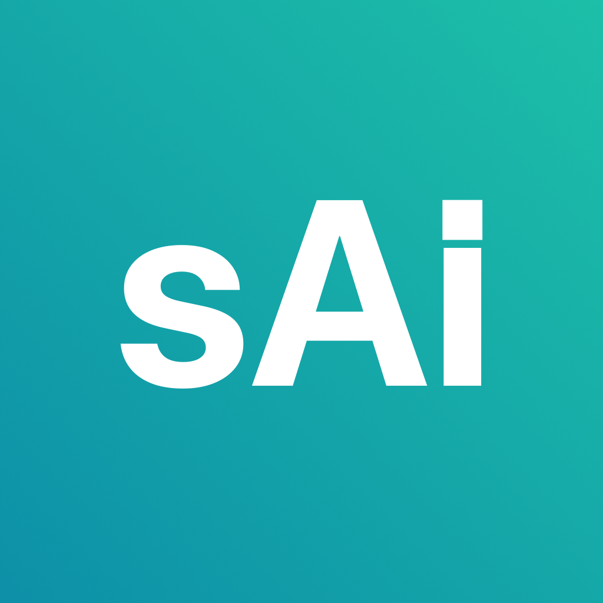
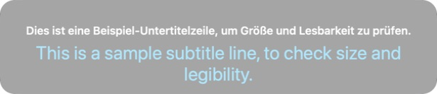
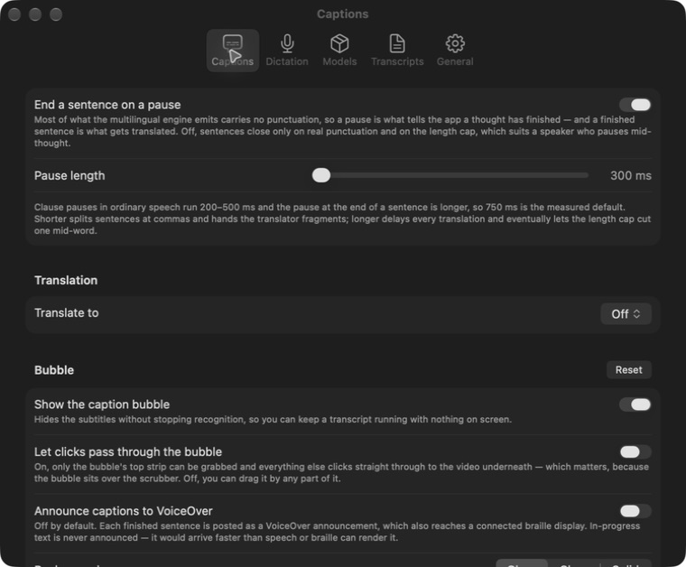
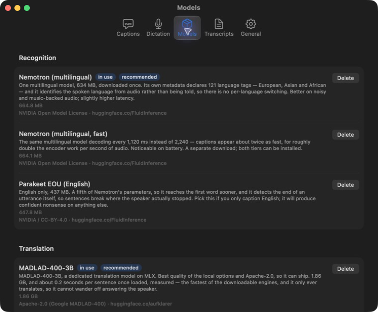
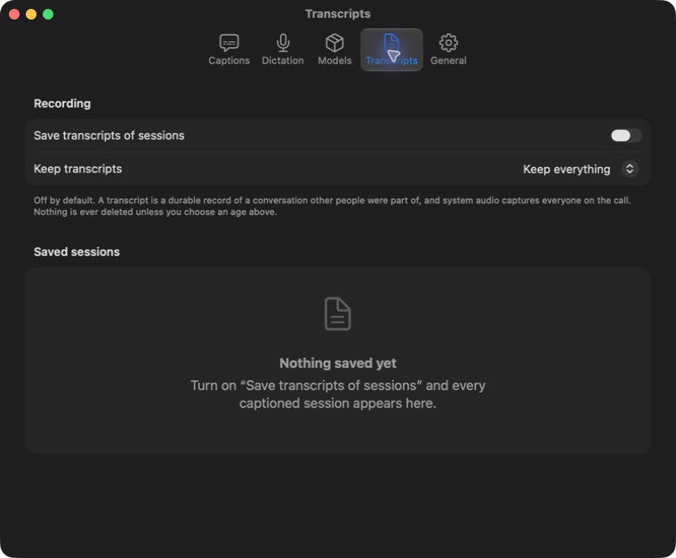
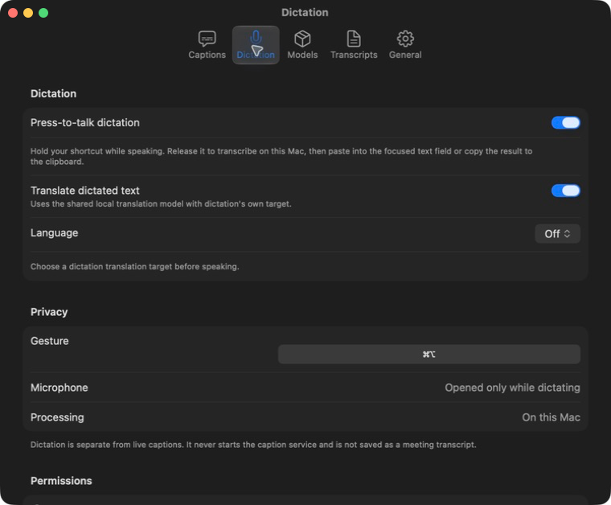

  

<h1 align="center">sAiity</h1>

<strong>Speech on the machine, not in the cloud.</strong>

Live captions, translation, transcripts, and press-to-talk dictation for macOS.

  <a href="https://github.com/enrzh/sAiity/releases/tag/v2.3.3">Download v2.3.3</a>
  &nbsp;&middot;&nbsp;
  <a href="https://enrzh.github.io/sAiity/appcast.xml">Sparkle update feed</a>
  &nbsp;&middot;&nbsp;
  <a href="https://enrzh.github.io/sAiity/privacy.html">Privacy</a>
  &nbsp;&middot;&nbsp;
  <a href="https://aiity.de">aiity</a>

  

  
  
  
  

## The product

| Capability | Description |
| --- | --- |
| **Captions** | Speech from your Mac's system audio becomes stable captions in a small, movable bubble. Recognition runs on the Mac. |
| **Translation** | Add a second line in another language with a local translation model. Original speech remains available. |
| **Dictation** | Hold a configurable key, speak, and release. Local cleanup removes clear fillers and repetitions while preserving the spoken language; the result is inserted into the focused field when possible and also kept on the clipboard. |
| **Transcripts** | Save sessions in the app with original and translated text together. Read them later or export SRT, WebVTT, Markdown, or plain text. |

## If something needs the network

Daily use does not. sAiity downloads the models you choose from their declared sources, then recognises and translates on-device. The signed app can check the opt-in Sparkle feed for updates. No account or API key is required.

## What we know about you

<strong>Nothing.</strong>

There is no account, tracking, telemetry, or audio upload. The microphone is opened for captions only when its explicit setting is enabled, and for dictation only while the press-to-talk key is held. Dictation cleanup is local and keeps the language that was spoken; translation remains a separate opt-in action. Saved transcripts stay on your Mac until you export or delete them.

Read the [German privacy policy](https://enrzh.github.io/sAiity/privacy.html) or [English privacy policy](https://enrzh.github.io/sAiity/en/privacy.html).

## Requirements and status

| Requirement | Details |
| --- | --- |
| **System** | macOS 26 or later on Apple Silicon. |
| **Captions** | Screen Recording permission for system-audio capture. |
| **Dictation** | Microphone permission while the push-to-talk key is held. Accessibility permission is needed for insertion into another app; clipboard fallback works without it. |
| **Release** | v2.3.3 is the current signed release. Windows is not supported. |

## Updates

GitHub Releases is the canonical download location. Sparkle reads the signed [appcast.xml](https://enrzh.github.io/sAiity/appcast.xml) from this GitHub Pages site, and the feed points to the matching ZIP in the GitHub Release.

The current release improves language-preserving dictation cleanup, including
long-tail languages, and passes source-language guidance into the local cleanup
prompt. Cleanup never translates the dictated text automatically.

Publish release assets before updating the feed. The feed is served from the main branch of this public repository.

## Source

This repository is the public product page and download surface. The implementation source is kept in a private repository. No source code or reuse license is provided here.

Part of the <a href="https://aiity.de">aiity</a> family.

