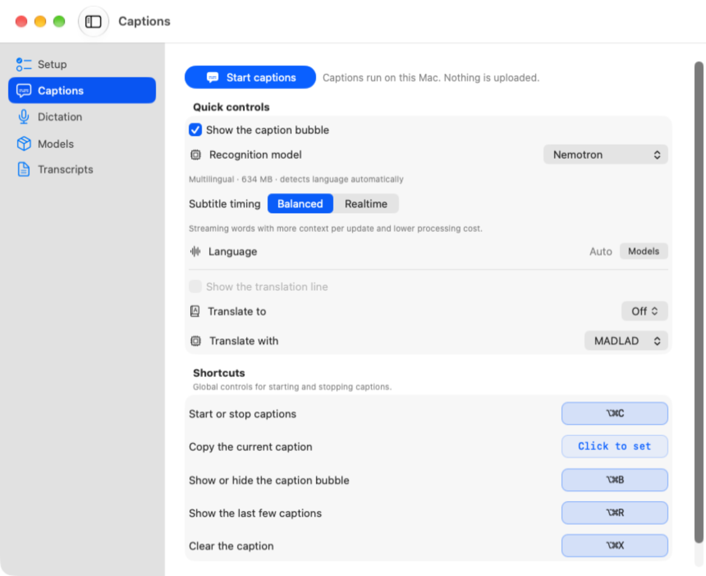
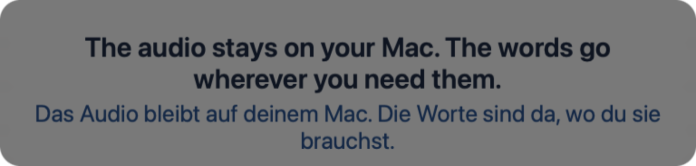
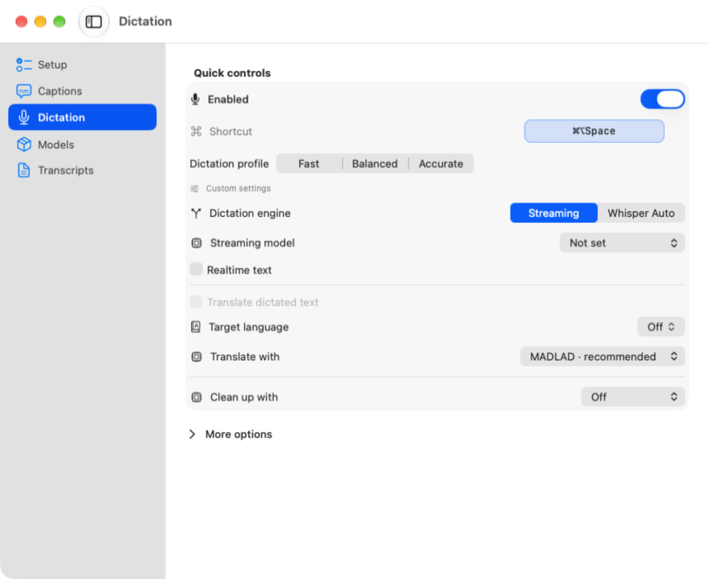
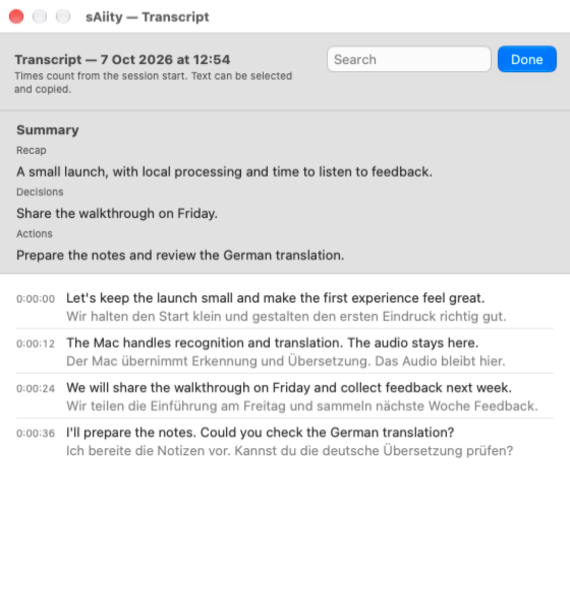

<h1 align="center">sAiity</h1>

<strong>Read what you hear. Keep what matters.</strong> Live captions, translation, dictation and transcripts. On your Mac.

  <a href="https://github.com/enrzh/sAiity/releases/download/v2.6.5/sAiity-2.6.5.dmg">Download for Mac</a> ·
  <a href="https://enrzh.github.io/sAiity/">Explore the app</a> ·
  <a href="https://github.com/enrzh/sAiity/releases/tag/v2.6.5">Release notes</a> ·
  <a href="https://enrzh.github.io/sAiity/en/privacy.html">Privacy</a>

**macOS 26 or later · Apple Silicon · No account or API key.**

## From listening to doing

- **Follow the conversation.** System audio becomes captions in a movable
  bubble. Nemotron offers Realtime or Balanced subtitle timing; Qwen is an
  optional pause-based alternative.
- **Keep both languages.** Local translation sits below the original. Choose
  complete sentences or realtime previews as the sentence grows.
- **Speak. Release. Done.** Hold your dictation shortcut, speak and release.
  The result is inserted into the field you started in when possible, and stays
  on the clipboard. Captions and dictation have independent model and language
  choices. A local dictionary protects names and stores explicit corrections.
- **Take the words with you.** Save bilingual transcripts, search sessions,
  and export SRT, WebVTT, Markdown or plain text. Add a local summary to revisit
  the essentials without changing the original spoken lines.

  
  

Freshly captured on **October 7, 2026**, from the **2.6.5 release UI** using
synthetic caption and transcript text. See [image provenance](screenshots/README.md).

## Install

1. [Download the signed, notarized DMG](https://github.com/enrzh/sAiity/releases/download/v2.6.5/sAiity-2.6.5.dmg)
   and move sAiity to Applications. [A ZIP is also available](https://github.com/enrzh/sAiity/releases/download/v2.6.5/sAiity-2.6.5.zip).
2. Choose captions, dictation or both. Setup walks you through local model
   downloads and the permissions for your chosen features.
3. For captions, macOS Screen Recording permission gates system audio. Dictation
   uses the microphone; Accessibility permits insertion into another app.

Models are downloaded on first use, not bundled in the app. Speed and storage
requirements depend on the models and your Mac. Intel Macs and Windows are not
supported releases.

## Privacy

Audio, recognition, translation and transcripts stay on your Mac. No audio
uploads, account, analytics or API key. Internet access is needed for model
downloads and optional update checks.

The caption microphone mixer is off by default. Dictation uses the microphone
only while you hold the shortcut. Sparkle update checks are opt-in.

[English policy](https://enrzh.github.io/sAiity/en/privacy.html) ·
[Datenschutzerklärung](https://enrzh.github.io/sAiity/privacy.html)

## Current release: 2.6.5

Local transcript summaries add a recap, decisions and action items using the
Gemma cleanup model already installed for dictation. Summaries can miss or
invent details; long sessions may omit earlier lines. Original spoken lines
and SRT/WebVTT exports stay unchanged. Markdown includes the summary once.

[Release notes and verification](https://github.com/enrzh/sAiity/releases/tag/v2.6.5) ·
[All releases](https://github.com/enrzh/sAiity/releases) ·
[Signed Sparkle feed](https://enrzh.github.io/sAiity/appcast.xml)

| Artifact | SHA-256 |
| --- | --- |
| DMG | `99fb2557d24de19bd602ce3f5206519e058dfa9a57adca131a28d2d93573e334` |
| ZIP | `a7b79d3b5278f4d2a84ea03410d07f8b212c0c0bc2e8674442d9f287f2446cc0` |

## About this repository

This repository holds public release assets, the website and privacy policies.
The application source is maintained separately. This is not an open-source
distribution of the app.

GitHub Pages serves plain HTML and CSS from the root of `main`. No framework,
build step, tracking scripts or external fonts. Preview locally with
`python3 -m http.server 8080` and open it using ego-browser. Keep versioned
download links aligned with the published release; publish release assets
before updating the signed feed.

Part of [aiity](https://aiity.de) · [hAiity for iPhone](https://enrzh.github.io/hAiity/)
